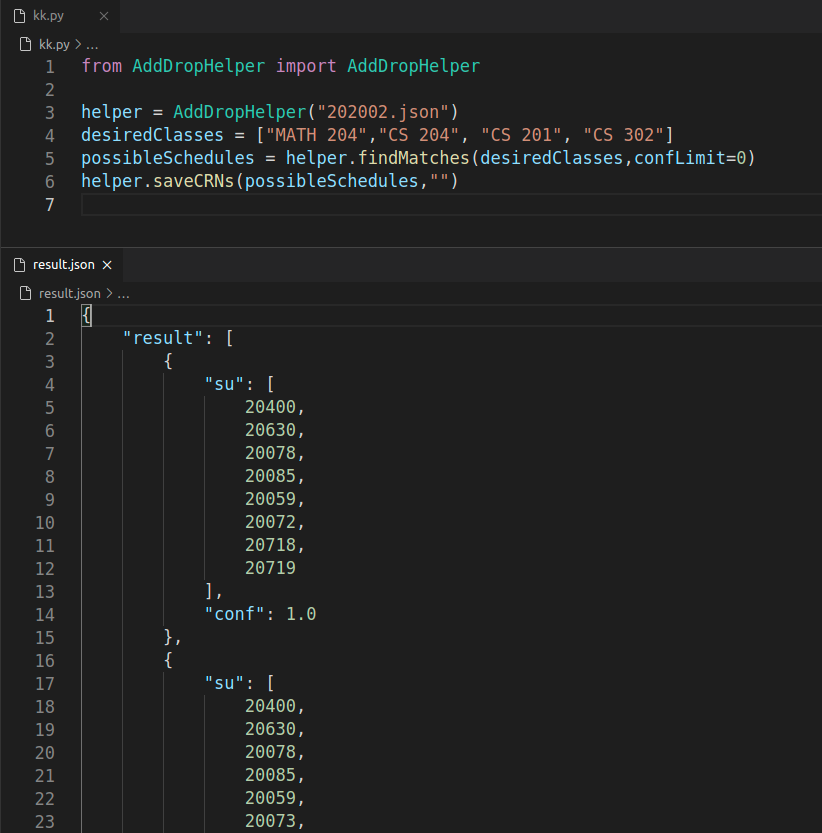

# Sabancı Schedule Arranger Algorithm
This program help students to arrange their schedules according to their desired courses.

By providing the required courses file, program finds all possible course placements without any conflict.
Maximum conflict option is available.

# How to use?

> Simple flask app integrated for ease of use, not recommended tho.